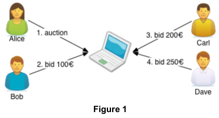
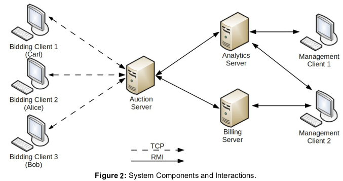
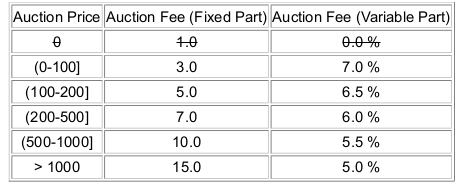

# Auction System

A simple auction system where multiple users bid in auctions similarly to [Ebay](https://www.ebay.at/). Auction system is a variant of the [English Auction](https://www.wikiwand.com/en/English_auction)  with the exception that the auction ends at specific time and date. All Bids are open and the current highest bid is visible to all participants.

 [//]:   

<p align="center">

</p>

### Basic CLI Auction Commands (*<h style="color:green">Bidding Clients</h>*)

 1) **!list**  -  Shows current unfinished auctions with auction id, object name, date of creation, auction duration and name of highest bidder

    + can be called without login

2) **!login** \<client-name\> 
   
   + Can not login multiple times
   + Only logged in user can create auctions and set a Bid

3) **!create** \<duration-seconds\> \<object-name\>
   + Auction owner notified when auction ended
   + Notification when Auction ended: **!auction-ended** \<user\> \<highest-bid-price\> \<object-name\>
4) **!bid** \<object-id\> \<object-bid\>
   + bid only set if higher than previous bid
   + Previous highest bidder is notified
   + Highest bidder is notified when auction ended - **!new-bid** \<object-name\>

    + Notification when Auction ended: **!auction-ended** \<user\> \<highest-bid-price\> \<object-name\>
5) **!logout** 
6)  **!end** - shuts down the client(after !logout)

### Auction Infrastructure (Overview)

Additional to the Bidding Clients we have an infrastructure with one Auction Server(*handles all realtime auctions*),
an Analytics Server(*monitor execution of the auction server and provide simple statistics to events*) and a 
Billing Server(*handles payment info of highest bidder and payment duties regarding owner of the auction*).

A Management Client is capable to configure the Billing Server and to monitor events from the Analytics Server.
As we can see in Figure 2, the server and management clients communicate over **Remote Invovation Methods**(RMI). 
For example if a new auction was created on the auctions server,or some another event happens, auctions server 
calls a method `processEvent(..)`, which actually is processed on the Analytics Server.
The Anayltics Server creates simple Statistics and afterwards calls processEvent(...) at the 
Management Client(which activated notification before) to display event statistics.

Clients and Server invoke different RMI methods to trigger some action or to process informations. 
Nevertheless, a return value is send back to the caller. 

Management Client performs following RMI:

```
- subscribe(...)   //register for notifications
- unsubscribe(...) //unregister for notifications
``` 

Auction Server performs following RMI:

```
- processEvent(...) //invoked(on analytics s.) by auction server each time a new event happens
 
```

Analytics Server performs following RMI:

```
- processEvent(...) //invoked(on Mgmt c.) by analytics server each time auction s.(analytics s.) invoked same RMI  
```


Billing Server performs following RMI:

```
- processEvent(...) //invoked by auction server each time a new event happens
- login(...)	//invoked(Billing Server) by Mgmt Client for authentication
- getPriceSteps()//returns configurations of Price Steps
- createPriceStep(...) //creates a Price Step for a given Interval,in Figure 3 we see a bundle of Price Steps, 
			command invoked(on Billing Server Secure) by Mgmt Client
- deletePriceSteps(...)//allows to delete  
- billAuction(...) //invoked(on Blling Server Secure) by auction server, as soon as an auction has ended
- getBill(...) //invoked(Billing Server Secure) by auction server or mgmt client,returns Bill history
	of given user(auction he owns and debts he has to pay)
```
<p align="center">

</p>

<p align="center">

</p>
<p align="center"> <b>Figure 3:</b> Price Table  </p>


### Advanced CLI Auction Commands (*<h style="color:green">Management Clients</h>*)

1) **!subscribe** \<filterRegex\>

	Invoke ```!subscribe ``` by management client to register for notifications.The method allows
	to set a simple subscription filter with the *Java Regular Expression* ,which is matched against the different 
	Event types. 

	Example: 

	``` !subscribe "(USER_.* )|(BID_.*)"  ```

	
	Current client subscribed for all USER Events and Events regarding BIDs.
	We summarize all possible Events:

	+ Statistics Events: *USER_SESSIONTIME_MIN*,*USER_SESSIONTIME_MAX*,*USER_SESSIONTIME_AVG*,*BID_PRCE_MAX*
					   *BID_COUNT_PER_MINUTE*,*AUCTION_TIME_AVG*,*AUCTION_SUCCESS_RATIO*

	+ Bid Event: BID_PLACED,BID_OVERBID,BID_WON

	+ User Event: USER_LOGIN, USER_LOGOUT, USER_DISCONNECTED

	+ Auction Event: AUCTION_STARTED, AUCTION_EVENT

	After subscription an ID is created and returned back to the Mgmt. Client.
	

2) **!unsubscribe** \<Subscription-ID\>

	Management Client uses ID to delete registration for notifications,ID was returned after !subscribe command.

3) **!print**

	Print all events that are currently in the buffer and have not been printed before.

2) **!auto**

	This command enables the automatic printing of events. Whenever an event is received by the clients,
	 its details are immediately printed to the command line.

3)  **!hide**

	This command disables the automatic printing of events. 
	Incoming events are temporarily buffered and can later be printed using the
	"!print " command. This should be the default mode when the client is started.

4) **!login** <username> <password>

	To interact with the Billing Server, an authentication must be performed.

5) **!steps**

	List all existing price steps. Example shown in **Figure** 3.


6) **!addStep** \<startPrice\> \<endPrice\> \<fixedPrice\> \<variablePricePercent\>


	Add a new Price Step according example in **Figure** 3.
 

7) **!removeStep** \<startPrice\> \<endPrice\> 

	Remove an existing price step.

8) **!bill** \<username\>

	Shows the Bill for a user name.Prints the list of finished auctions(plus auction fees) that have been created
	by specified user.To determine the fees of the bill,apply the current price steps configuration to the prices
	of each of the user's auctions.
	
9) **!logout**

	Set the client into "logged out" state, after that on that client a user must again login with ```!login(...)```

### USAGE

 
- Ant template:
   + ant build.xml
   + 10.000 + dslabXXX * 10 and 10.000 + (dslabXXX + 1) * 10 - 1.
   


### TECHNOLOGIE USED

##### Java Core Components

+ IO Package 
+ Concurrency: Thread API,Runnable API, ExecutorService API, Executors API
+ Network:  ServerSocket API, Socket API, DatagramSocket API, DatagramPacket API  

##### Remote Method Ivocation

#####  


